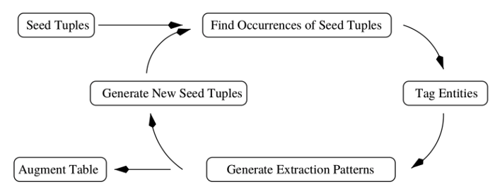

### Article: Different ways of doing Relation Extraction from text

Link: https://medium.com/@andreasherman/different-ways-of-doing-relation-extraction-from-text-7362b4c3169e#:~:text=Relation%20Extraction%20(RE)%20is%20the,%2C%20is%20in%2C%20France).

**Purpose**: Apply RE to extract **Parent Company**. Currently applying NER+rules to identify it. The precision is high but comes with low recall. Looking for a smarter way to do this.

Relation Extraction is a subfield of Information Extraction. There are 5 different methods to perform this task:

1. Rule-based RE
2. Weakly supervised RE
3. Supervised RE
4. Distantly Supervised RE
5. Unsupervised RE

#### **Rule-based RE**
1. Change sentence sequence based on dependency path.
2. Identify entities using NER.
3. Identify relations based on rules (regex).

Pros: high precision, specific domain.
Cons: low recall, human efforts, various rules.

#### **Weakly Supervised RE**
1. start with seed tuples.
2. extract occurrences from the unlabeled text that matches the tiples and tag them with a NER.
3. create pattens for thses occurrences.
4. Generate new tuples based on the patterns and add to the seed tuples.
5. go to step 2 and repeat until there is no more new seeds.

Pros: higher recall, less efforts.

Cons: more errors, misidentified relations, new relations require new seeds.

#### **Supervised RE**
train a stacked binary classifier (or a regular binary classifier) to determine if there is a specific relation between two entities.

Pros: explicit negative samples, high quality result. 

Cons: Expensive to label data, expensive to add new relations, does not generalize well to new relations, only feasible for a small set of relation types.

#### **Distantly Supervised RE**
1. extract relations tuples from existing Knowledge Base (KB)
2. select sentences from the unlabeled text data and match tuples, assume that these sentences are positive for this relation type.
4. extract features from these sentences.
5. train supervised classifier on this.

Pros: Less manual efforst, scalable to use large amount of labeled data and other relations, no repeated iterations required.

Cons: noise, no explicit negative examples, restricted to KB, may require careful tuning

#### **Unsupervised RE**
Open IE.

1. train a self-supervised classifier on a small corpus.
- For each parsed sentence, find all pairs of noun phrases with a sequence of words r connecting them. Label them as positive if they meet all the constrains, otherwise label as negative.(X,r,Y)
- map each triple (X, r, Y) to a feature vector representation.
- tarin a binary classifier to identify the trustworthy candidates.
2. pass over the entire corpus and extract possible relations.
- fetch potential relations from corpus
- keep/discard candidates according to if the classifier considers them as trustworthy or not
3. Rank-based assessment of relations based on text redundancy
- normalize and merge relations that are the same
- count the number of distinct sentences that relations are present in and assign probabilities to each relation

More reading will be performed on this part and stored in literature review.