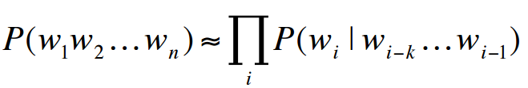
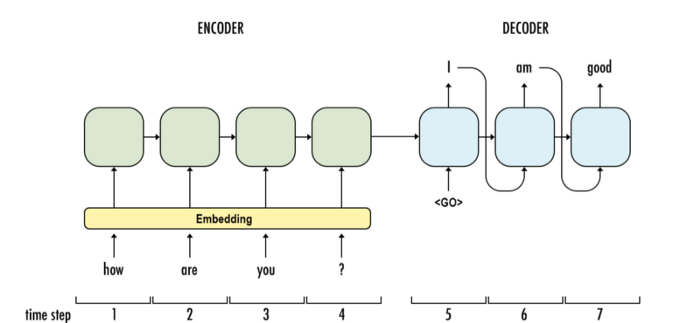
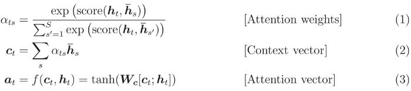

### Article: A Brief Overview of Attention Mechanism

Link: https://medium.com/syncedreview/a-brief-overview-of-attention-mechanism-13c578ba9129

**Target**: Understand the cons of RNN, LSTM, GRU and introduce the Attention mechanism.

**Paper**: https://arxiv.org/abs/1706.03762

#### **What is Attention?**
Attention is simply a vector, often the outputs of dense layer using softmax function.

#### **Why Attention?**
Due to the nature of sentences that consist of different numbers of words, RNN is naturally introduced to model the conditional probability among words.

**Vanilla RNN**

Cons:
1. Structure Dilemma: in real world, the length of outputs and inputs can be totally different, while Vanilla RNN can only handle fixed-length problem which is difficult for the alignment. Consider an EN-FR translation examples: “he doesn’t like apples” → “Il n’aime pas les pommes”.
2. Mathematical Nature: it suffers from Gradient Vanishing/Exploding which means it is hard to train when sentences are long enough (maybe at most 4 words).

**LSTM/GRU**

The encoder-decoder system comprises of two parts: encoder and decoder. The encoder reads the input words sequentially and generates a hidden state and pass to next timestamp. After the encoder finishes reading the sentence, it generates an output and a hidden state and pass to the decoder, then the decoder generate translation words sequentially.

The question is: is one hidden state enough?

**Attention**

Comparing to normal encoder-decoder system, there is an additional context vector that takes all encoder cells' output as input for the decoder.

To build context vector:

For a fixed target word, first, we loop over all encoders’ states to compare target and source states to generate scores for each state in encoders. Then we could use softmax to normalize all scores, which generates the probability distribution conditioned on target states. At last, the weights are introduced to make context vector easy to train. That’s it. Math is shown below:

1. During decoding, context vectors are computed for every output word. So we will have a 2D matrix whose size is # of target words multiplied by # of source words. Equation (1) demonstrates how to compute a single value given one target word and a set of source word.
2. Once context vector is computed, attention vector could be computed by context vector, target word, and attention function f.

More to explore from the paper and implementation example.

