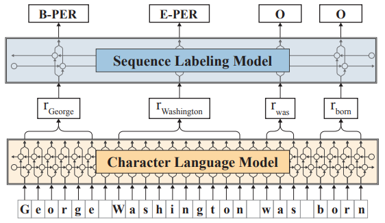
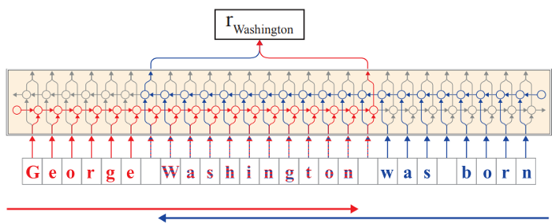

### Article: Contextual Embeddings for NLP Sequence Labeling
Paper: Contextual String Embeddings for Sequence Labeling

Article Link: https://towardsdatascience.com/contextual-embeddings-for-nlp-sequence-labeling-9a92ba5a6cf0

Paper Link: http://alanakbik.github.io/papers/coling2018.pdf

The article mainly introduces a noval string embedding method that represents the same word in different embedding vectors w.r.t the context.

#### **Architecture**
The overall design is that passing a sentence to **Character Language Model** to retrieve Contextual Embeddings such that Sequence Labeling Model can classify the entity.

**Contextual Embedding**

The character language model applied Bi-LSTM architecture. 

Characters are treated as atomic units of language modeling (Graves, 2013), allowing text to be treated as a sequence of characters passed to an LSTM which at each point in the sequence is trained to predict the next character. This means that the model possesses a hidden state for each character in the sequence.

A forward-backward recurrent neural network to create contextualized
word embeddings. This means, alongside with the forward model, a backward model works in the same way but in the reversed direction.

Below chart shows the extraction of a contextual string embedding for a word (“Washington”) in a sentential context. From the forward
language model (shown in red), we extract the output hidden state after the last character in the word. This hidden state
thus contains information propagated from the beginning of the sentence up to this point. From the backward language model
(shown in blue), we extract the output hidden state before the first character in the word. It thus contains information propagated
from the end of the sentence to this point. Both output hidden states are concatenated to form the final embedding.

